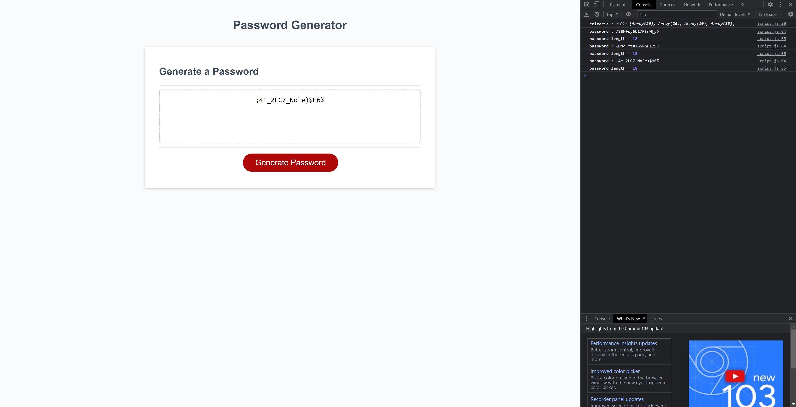

# Password Generator Starter Code
## [Live Site](https://hunter-williams.github.io/password-generator/)

- This live site will generate a random password through selected criteria,
if no criteria is selected one will be chosen for you.

- At the top theres a matrix array of criteria options
- The live site will prompt the user with a confirm of the criteria options in a series of if else statements
- If no response is give, it uses a Math.random to choose default.
- Uses a for loop to generate random characters from user criteria, at the length of the users  input.
- Uses query selectores to write the password to the page.

